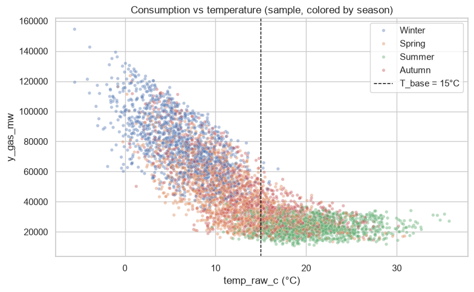
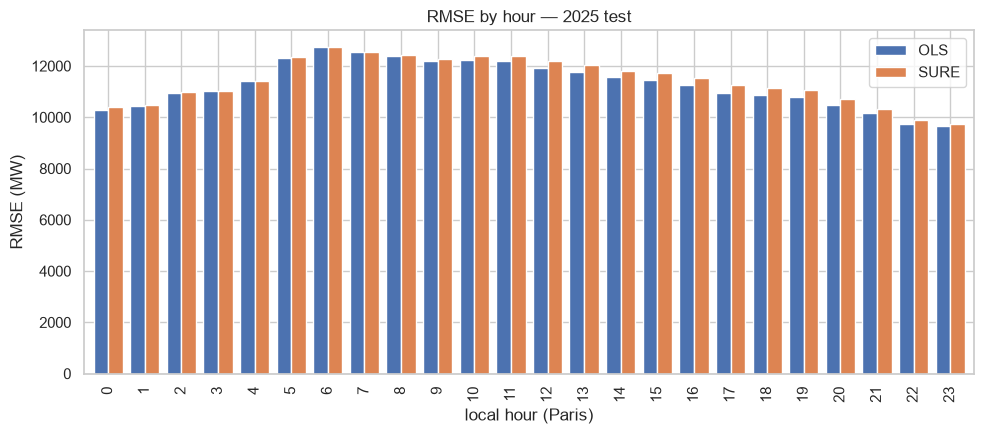
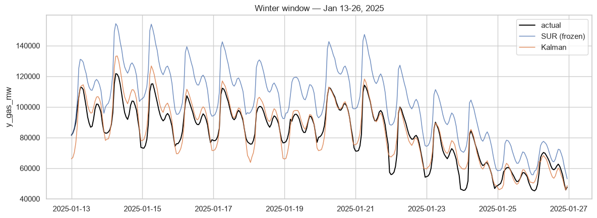
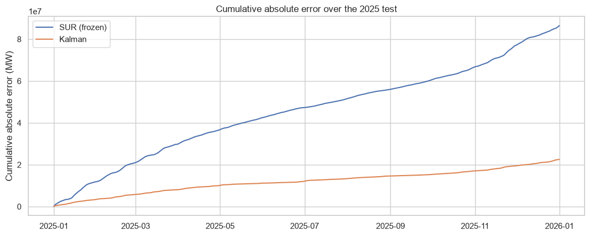
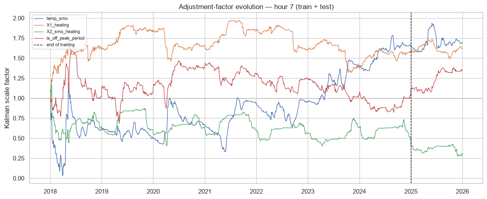

<div align="center">

# gas-hourly-forecast

**Hourly forecasting of French natural gas consumption, powered by a dynamically-adjusted Kalman/SUR model.**

[](https://gas-hourly-forecast.streamlit.app/)
[](https://github.com/PierreRobinSchnepf/special-train/actions/workflows/tests.yml)
[](LICENSE)
[](#installation)

[**🔗 Try the live dashboard →**](https://gas-hourly-forecast.streamlit.app/)


</div>

---

## Overview

`gas-hourly-forecast` builds an hourly, gap-free dataset of French natural gas consumption (2018–present) and benchmarks three forecasting models — hourly OLS, SURE (Zellner), and a Kalman-adjusted SUR — to predict `y_gas_mw` one day ahead. An interactive Streamlit dashboard exposes forecasts, backtests, and a live pipeline fed by fresh weather and consumption data, at both national and regional (12 gas regions) granularity.

## Table of contents

- [Features](#features)
- [Installation](#installation)
- [Usage](#usage)
- [Data sources](#data-sources)
- [Modeling](#modeling)
- [The mathematics](#the-mathematics)
- [Project structure](#project-structure)
- [Tests](#tests)
- [Deployment](#deployment)
- [Roadmap](#roadmap)
- [License](#license)

## Features

- **Gap-free hourly dataset (2018–present)** — UTC-indexed pipeline merging gas consumption, hourly temperature, public holidays, and school holidays.
- **Three benchmarked models** — independent hourly OLS, joint SURE (FGLS), and a Kalman filter that lets SUR coefficients drift over time.
- **National + 12 regional forecasts** — the same model stack, parameterized per gas region.
- **Live pipeline** — a daily job pulls real weather and consumption data and produces genuine one-day-ahead forecasts, tracked against actuals once they land.
- **Interactive dashboard** — a clickable map of France, forecast curves with confidence intervals, a weather what-if tool, day-by-day benchmark view, and rolling accuracy tracking.

## Installation

```bash
git clone https://github.com/PierreRobinSchnepf/special-train.git
cd special-train
python -m venv .venv
source .venv/bin/activate      # .venv\Scripts\activate on Windows
pip install -r requirements.txt
```

That's it — one `requirements.txt`, no system dependencies.

## Usage

```bash
# 1. Build the full dataset (downloads ~1.3 GB of raw data, 2018 -> today)
python scripts/build_dataset.py

# 2. Train and persist the national models (~2 min)
python scripts/train_models.py

# 3. Regional pipeline (12 gas regions)
python scripts/fetch_data.py --only gas_regional
python scripts/build_regional_dataset.py
python scripts/train_regional_models.py

# 4. Run the dashboard locally
streamlit run dashboard/app.py

# Optional: run today's real one-day-ahead forecast
python -m pipeline.run_daily
```

Useful variants: `--sample-months 1` (quick 1-month build), `--skip-fetch` (reuse the raw cache). Outputs land in `data/processed/` (datasets + QC reports) and `data/models/` (pickled models).

## Data sources

| Source | Provider | Native frequency | Timezone |
|---|---|---|---|
| Gas consumption | ODRÉ (`consommation-quotidienne-brute`) | hourly | UTC |
| Regional gas (industrial + distribution) | ODRÉ (2 datasets, summed per region) | hourly | Europe/Paris |
| Temperature | Météo-France (hourly climatological data, by department) | hourly | UTC (SYNOP) |
| Public holidays | data.gouv.fr / etalab | daily | Europe/Paris |
| School holidays | data.education.gouv.fr (zones A/B/C) | intervals | Europe/Paris |
| Near-real-time weather | Open-Meteo (AROME model, no key required) | hourly | UTC |

The dataset is indexed in continuous UTC to sidestep Europe/Paris DST transitions entirely; calendar-dependent features are derived by converting timestamps to local time only to extract the civil date, never by re-indexing on it. Full column-by-column reference: [docs/data-dictionary.md](docs/data-dictionary.md). Rationale for every non-obvious choice: [docs/design-decisions.md](docs/design-decisions.md).

## Modeling

Three models forecast each of the 24 local hours independently, from the same feature set (thermal inertia, Fourier seasonality, calendar effects):

- **Hourly OLS** — 24 fully independent regressions.
- **SURE** (Zellner, 1962) — the same system estimated jointly via FGLS, exploiting same-day correlation across hourly residuals.
- **Kalman-adjusted SUR** — each SUR coefficient gets a multiplicative scale factor estimated by a Kalman filter, letting effects drift over time while keeping the SUR structure explainable.

Trained on 2018–2024, tested on full-year 2025. Across the 12 gas regions, the Kalman model beats SURE on RMSE by 16% on average (regional test MAPE: Kalman 7.6% vs. SURE 12.0%).

Pre-trained artifacts live in `data/models/`; the dashboard and pipeline load them directly rather than retraining on every run.

## The mathematics

### Feature engineering (Table 1)

The target is driven almost entirely by heating demand, which reacts to temperature with inertia. The **thermal block** captures this with three causal features built from the population-weighted national temperature $T_t$:

$$
X^{(1)}_t = \max(0,\; T_{\text{base}} - T_t), \qquad T_{\text{base}} = 15{°}\mathrm{C}
$$

$$
T^{\text{smo}}_t = \kappa\, T^{\text{smo}}_{t-1} + (1-\kappa)\, T_t, \qquad \kappa = 0.98
$$

$$
X^{(2)}_t = \max(0,\; T_{\text{base}} - T^{\text{smo}}_t)
$$

$X^{(1)}$ is the immediate reaction to cold; $T^{\text{smo}}$ is an exponentially-smoothed temperature (a causal EWMA — the recursion only ever sees the past); $X^{(2)}$ is the heating **inertia** term (buildings keep consuming after a cold spell ends). The heating threshold is clearly visible in the data:

<p align="center"></p>

**Annual seasonality** is a truncated Fourier basis on the day of year $d$, duplicated for weekdays (WD) and weekends (WE) so the two regimes get separate seasonal shapes:

$$
\cos_s = \cos\!\Big(\tfrac{2\pi s\, d}{365.25}\Big),\quad \sin_s = \sin\!\Big(\tfrac{2\pi s\, d}{365.25}\Big),\qquad s = 1,\dots,4
$$

each masked to zero outside its regime. **Calendar effects** are dummies: `is_monday`, `is_friday`, `is_saturday`, `is_sunday`, `is_end_of_year` (Dec 24–31), and `is_off_peak_period` (holiday OR school break OR end of year). With the intercept, $k = 26$ predictors per equation.

### Model 1 — hourly OLS

The day is split into 24 separate equations, one per Europe/Paris local hour $h$:

$$
y_{t,h} = \mathbf{x}_{t,h}^{\top} \boldsymbol\beta_h + \varepsilon_{t,h},
\qquad h = 0, \dots, 23
$$

estimated independently. This is the naive baseline: no information is shared across hours.

### Model 2 — SURE (Seemingly Unrelated Regressions)

The 24 equations are *not* unrelated: an unobserved daily shock (fine-grained weather, an unusual day) hits all hours of the same day at once, so the residuals are contemporaneously correlated:

$$
\mathrm{Cov}(\varepsilon_{t,h},\, \varepsilon_{t,h'}) = \Sigma_{hh'} \neq 0
$$

Zellner's FGLS estimator exploits this. Stage 1 runs 24 OLS regressions and estimates $\widehat\Sigma = \frac{1}{T}\sum_t \widehat{\boldsymbol\varepsilon}_t \widehat{\boldsymbol\varepsilon}_t^{\top}$ (24×24). Stage 2 whitens the stacked system with $P = \mathrm{chol}(\widehat\Sigma)^{-1}$ and re-estimates:

$$
\widehat{\boldsymbol\beta}^{\text{SURE}} = \big(X^{\top}(\widehat\Sigma^{-1} \otimes I_T)X\big)^{-1} X^{\top}(\widehat\Sigma^{-1} \otimes I_T)\,\mathbf{y}
$$

The implementation never forms the $(24T)\times(24T)$ covariance: ordered day-first, it is block-diagonal with $T$ identical 24×24 blocks, so the whitening is applied day by day (see `models/sure.py`). The efficiency gain over OLS is concentrated where residual correlation is strongest:

<p align="center"></p>

### Model 3 — Kalman-adjusted SUR

French gas consumption fell ~30% between 2019 and 2025 (energy crisis, sobriety measures) — no static coefficient can hold over such a period. The final model keeps the SUR structure but lets every effect drift, through a multiplicative adjustment factor:

$$
\beta^{\text{true}}_{t,h,j} = \beta^{\text{SUR}}_{h,j} \cdot \beta^{\text{Kalman}}_{t,h,j}
$$

$$
y_{t,h} = \beta_0 + \sum_j \big(\beta^{\text{SUR}}_{h,j}\, \beta^{\text{Kalman}}_{t,h,j}\big)\, x_{t,h,j} + \varepsilon_{t,h}
$$

Worked in log space ($\log(1+y)$, so factors are comparable across variables), this is a linear-Gaussian state-space model per hour, with the state $\boldsymbol\beta_t$ = the vector of adjustment factors:

$$
\text{state:} \quad \boldsymbol\beta_t = \boldsymbol\beta_{t-1} + \boldsymbol\eta_t, \qquad \boldsymbol\eta_t \sim \mathcal N(0, W)
$$

$$
\text{observation:} \quad \tilde y_t = H_t \boldsymbol\beta_t + \varepsilon_t, \qquad \varepsilon_t \sim \mathcal N(0, V_h)
$$

where $H_{t,j} = \beta^{\text{SUR}}_{h,j} x_{t,h,j}$ is the SUR structural contribution — this anchoring is what makes the state interpretable as "how far today's effect is from its historical average" (1 = no departure). The standard Kalman recursion (predict, innovate, update with gain $K_t = P_{t|t-1}H_t^{\top}S_t^{-1}$) yields honest one-step-ahead forecasts and, as a by-product, a 95% CI from the predictive variance $S_t$. The observation noise $V_h$ is set to the SUR's log-space residual variance for hour $h$; the intercept stays fixed (per the specification), and the process noise is $W = 10^{-4} I$.

The result on the held-out 2025 test — the Kalman-adjusted SUR (orange) tracks actual consumption (black) where the frozen SUR (blue) drifts:

<p align="center"></p>

The filter pays off exactly where the static model fails — the cumulative error gap widens through the whole test year:

<p align="center"></p>

And the estimated scale factors are directly interpretable — here the factor on `temp_smo` climbs over 2022-2024 as the thermal sensitivity of demand shifts, while `X2_smo_heating` decays:

<p align="center"></p>

Full derivations, diagnostics (including a faithful reproduction of the reference implementation and a convergence study of the filter gain) live in the [notebooks](notebooks/).

## Project structure

```
config.yaml                # single source of truth for parameters/thresholds/URLs
requirements.txt
scripts/                   # CLI entry points
  fetch_data.py              # step 1: raw ingestion, idempotent, -> data/raw/
  build_dataset.py           # steps 2-5: alignment, features, QC, export
  build_regional_dataset.py  # same schema, per gas region
  train_models.py            # national artifacts (backtest + production)
  train_regional_models.py   # regional artifacts (12 regions x 2 sets)
  upload_artifacts.py        # push runtime artifacts to S3 (deployment)
src/                       # feature engineering + config + storage
models/                    # OLS, SURE, Kalman implementations + persistence
dashboard/                 # Streamlit app (map, forecasts, live pipeline)
pipeline/                  # daily real-world forecasting job
notebooks/                 # EDA, OLS/SURE benchmark, Kalman study & diagnostics
tests/                     # unit tests (pytest)
docs/                      # data dictionary, design decisions, deployment guide
```

## Tests

```bash
pytest tests/ -v
```

29 tests cover the feature formulas (EWMA smoothing, thermal clipping, Fourier weekday/weekend masking, DST edge cases), model correctness on synthetic data (OLS/SURE coefficient recovery, FGLS whitening, Kalman drift tracking), and the regional parsing (local-time conversion, operator summing, isolated-dip filter). They run in CI on every push.

## Deployment

The live demo runs on Streamlit Community Cloud, with runtime artifacts served from an S3 (MinIO) bucket and synced at boot; write actions (data refresh, live forecast) are admin-gated. Full guide: [docs/deployment.md](docs/deployment.md).

## Roadmap

- [ ] Automated daily scheduling for the real pipeline (currently manual)
- [ ] Mid-August consumption dip as an explicit feature
- [ ] Extend regional coverage below the department level

## License

MIT — see [LICENSE](LICENSE).

---

<div align="center">
<sub>Built with Streamlit, statsmodels, and a Kalman filter. Not affiliated with GRTgaz, Teréga, or Météo-France.</sub>
</div>
